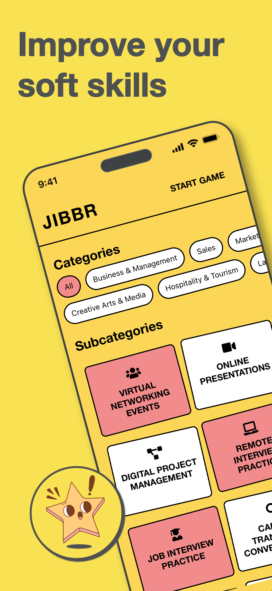
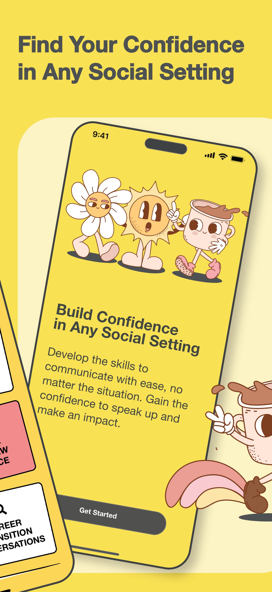
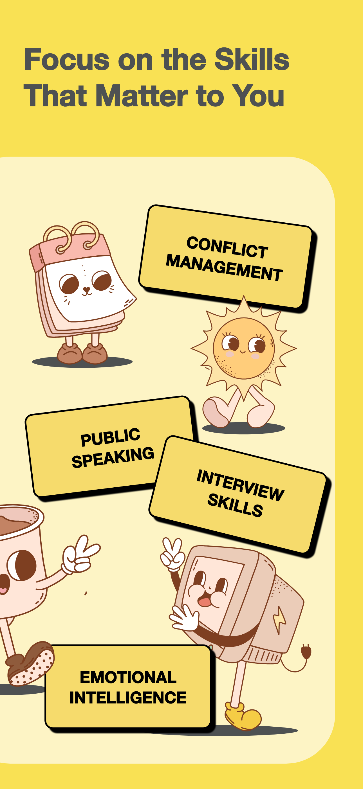

# Jibbr

**Transform Your Soft Skills with Jibbr**

In today's competitive world, strong soft skills are essential for personal and professional success. Jibbr is your personal coach, leveraging advanced AI to help you develop and refine essential soft skills through interactive, open-ended prompts.

---

### Screenshots

  
  
  
  
  

# Jibbr Contact and Privacy Policy

Welcome to the contact and privacy page for Jibbr. Here, you’ll find information on how to reach us and details on our privacy practices.

---

## Contact Us

If you have any questions, feedback, or need assistance, we’re here to help.

- **Email Support:** For any support-related inquiries, please contact us at [nugdev2024@gmail.com](mailto:nugdev2024@gmail.com).

Our team is available to assist with any inquiries related to Jibbr and its services.

---

## Privacy Policy

**Effective Date:** November 4, 2024

Jibbr ("we," "our," or "us") is committed to protecting your privacy. This Privacy Policy explains how we collect, use, and protect the personal information you provide when using the Jibbr app.

### 1. Information We Collect

We collect the following types of information:

- **Response Data:** Your responses to prompts, which are analyzed to provide you with personalized feedback and insights. This data is securely stored and confidential.
- **Usage Data:** Data collected automatically when you interact with Jibbr, including app activity and preferences, to help us improve the app.

### 2. How We Use Your Information

We use the information we collect for the following purposes:

- To provide, operate, and maintain the Jibbr app and its feedback features.
- To enhance your experience with personalized insights and progress tracking.
- To communicate with you regarding updates, support, or feedback.

### 3. Data Security

We take data security seriously and implement measures to protect your information. However, please note that no transmission over the internet is entirely secure.

### 4. Contact Information

If you have any questions or concerns about this Privacy Policy or need support, please reach out to us:

- **Email:** [nugdev2024@gmail.com](mailto:nugdev2024@gmail.com)

### 5. Updates to This Privacy Policy

We may update this Privacy Policy from time to time to reflect changes in our practices. We encourage you to review this page periodically.

---

## Frequently Asked Questions (FAQ)

Here are answers to some common questions to help you with the Jibbr app.

### 1. How do I get started with Jibbr?

Download the Jibbr app, set your profile preferences, and begin engaging with interactive prompts designed to build your soft skills.

### 2. How does Jibbr provide feedback?

Jibbr uses advanced AI to analyze your responses to prompts and provides detailed, constructive feedback to help you improve communication, teamwork, leadership, and other soft skills.

### 3. Is my data secure with Jibbr?

Absolutely. We prioritize your privacy and data security. All interactions are confidential and securely stored to protect your privacy.

### 4. How often should I use Jibbr?

You can use Jibbr as often as you like. The app is designed for flexibility, so you can engage with prompts at your own pace, whether daily, weekly, or whenever it fits your schedule.

### 5. Can I suggest new features or improvements?

We welcome feedback! Feel free to contact us at [nugdev2024@gmail.com](mailto:nugdev2024@gmail.com) with any suggestions or ideas for improving Jibbr.

---

Thank you for using Jibbr! We hope this FAQ section helps, and please reach out if you have further questions.

### Copyright
&copy; 2024 Yoonibo LLC - All rights reserved.
